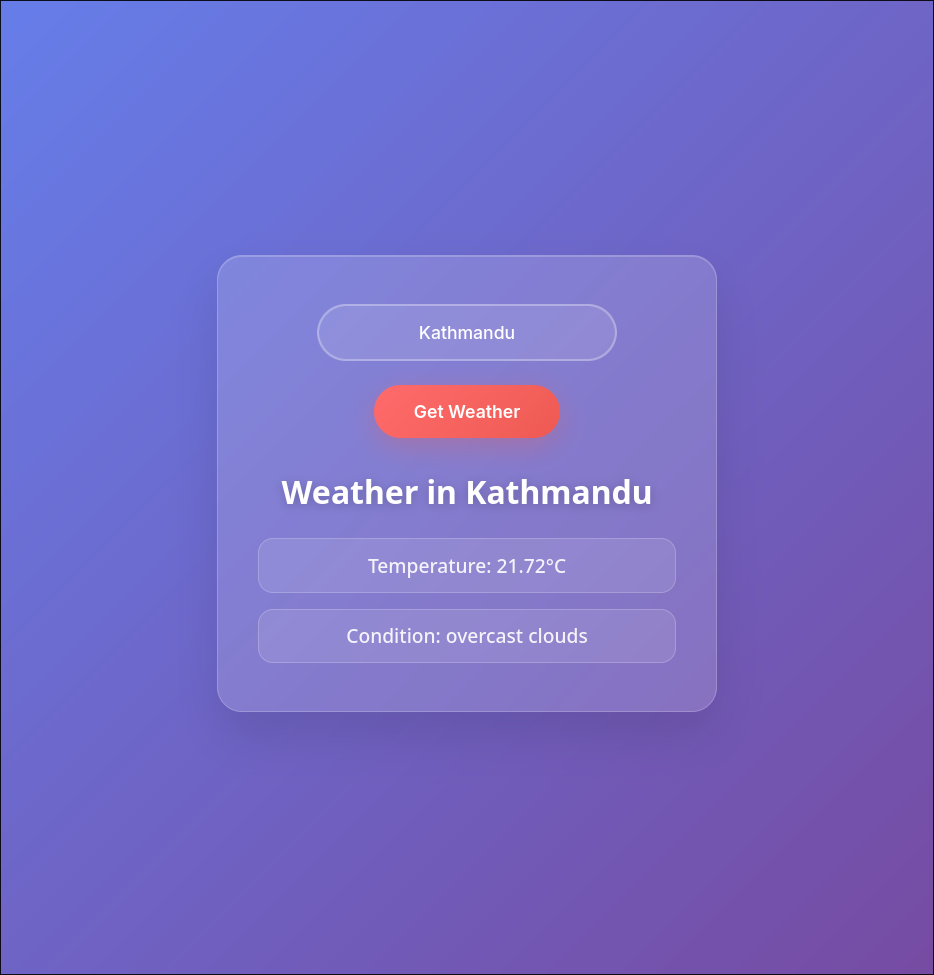

# WeatherApp

WeatherApp is a clean and user-friendly web application built with ASP.NET Core. It allows users to quickly check the current weather conditions for any city worldwide by fetching real-time data from the OpenWeatherMap API. The app features a sleek, responsive design optimized for both desktop and mobile devices, providing accurate temperature, weather descriptions, and more — all with minimal input and instant results.

